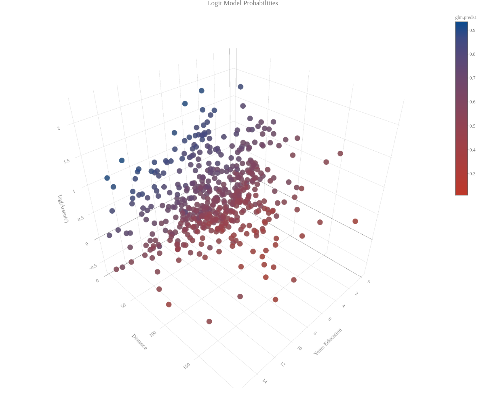
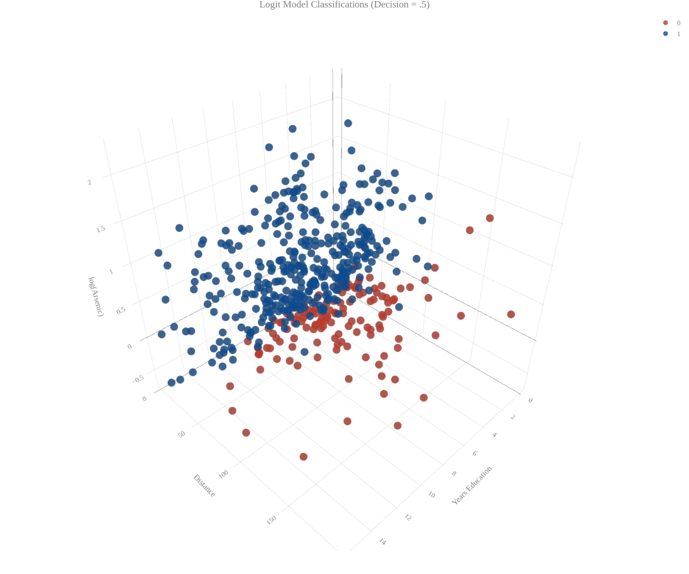
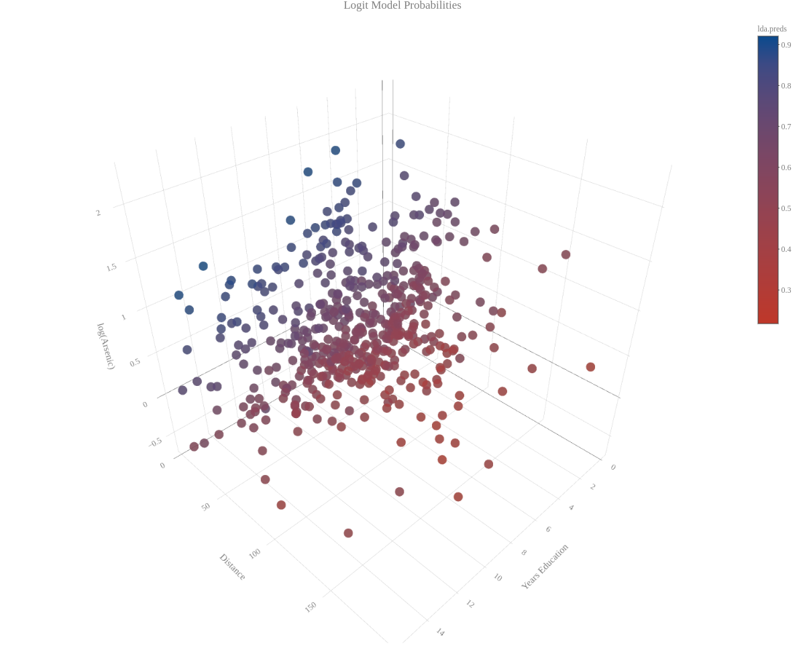
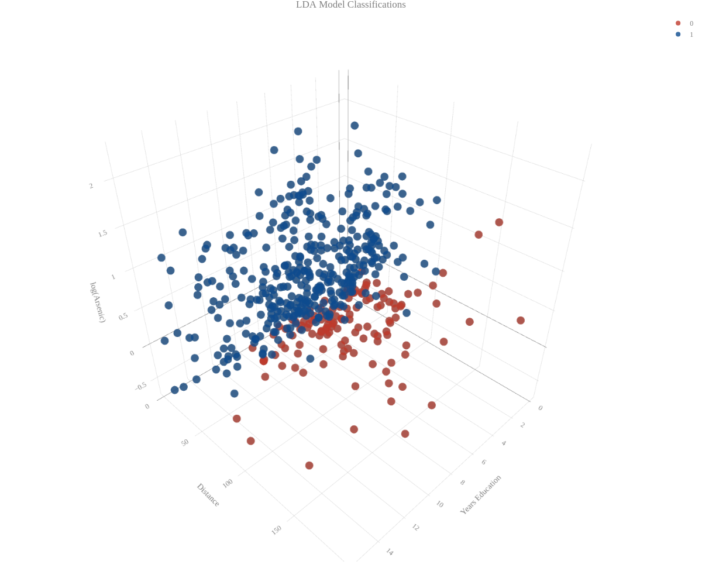
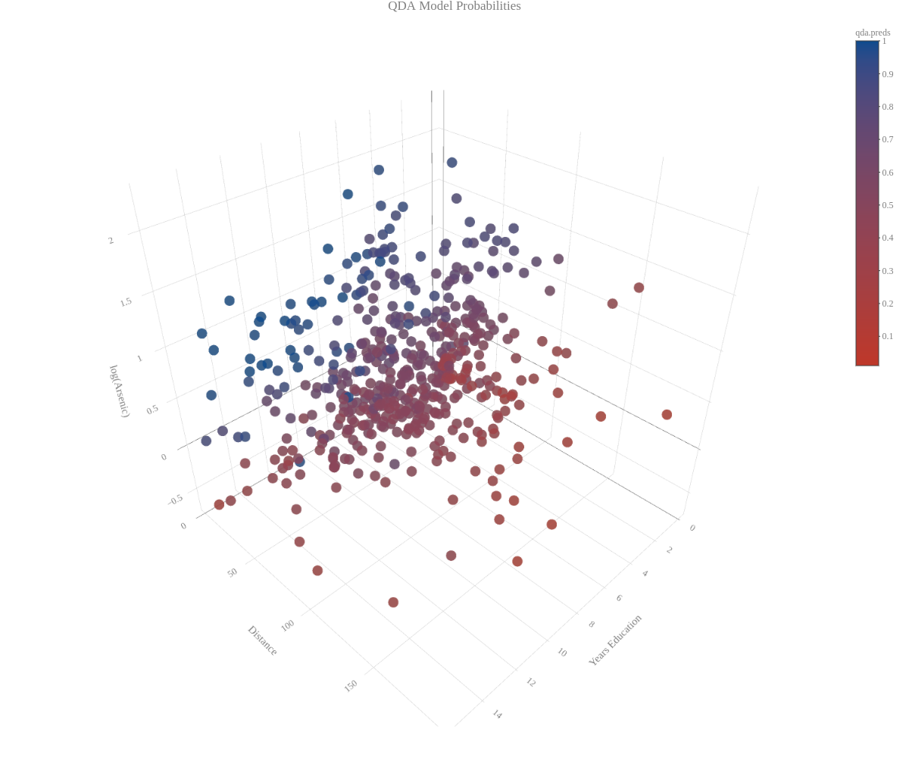
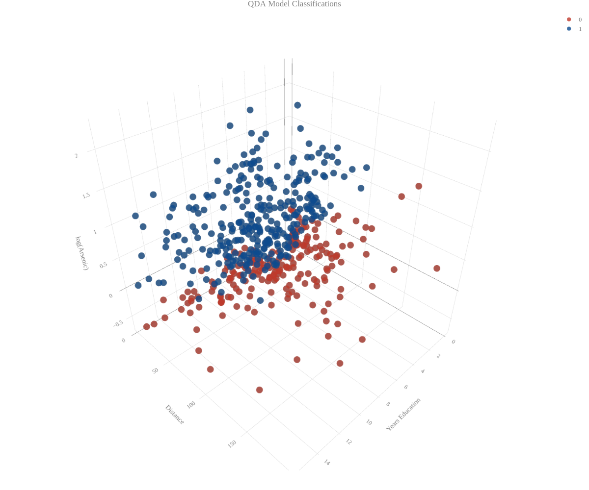
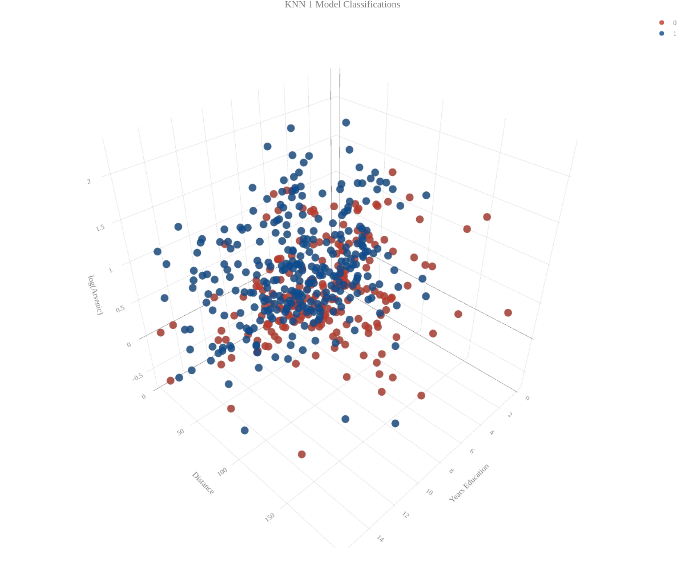

```{r, echo = FALSE, message = FALSE, warning = FALSE}

### Load libraries
library(pROC)
library(class)
library(knitr)
library(readr)
library(ggplot2)
library(extrafont)
library(stargazer)
library(extrafontdb)
library(grid)
library(gridExtra)
library(GGally)
library(wesanderson)
library(plotly)
library(reshape2)
library(arm)
library(dplyr)
library(verification)

```

```{r, echo = FALSE, message = FALSE, warning = FALSE}

### Load data
wells = read.table("wells.txt")


```


# Question #1

## a. Construct a good logistic regression model predicting the decision to switch wells as a function of the 4 predictors (arsenic, distance, association and education) on the training data. Consider potential transformations of continuous variables and possible interactions.

  For this analysis, our goal is to create a model that can classify people who switch wells and people who don't. We start with exploratory analysis: we check the distribution of the variables, their relationships,  and their transformations. Our model fitting process starts with variable selection for a logistic regression. We also try linear discriminant analysis, quadratic discriminate analysis, and the K nearest neighbor method.

Here are the summary statistics for the "wells.txt" data:

```{r, echo = FALSE, results = 'asis', warning = FALSE, message = FALSE}

### Summary Table

stargazer(wells, 
          header = FALSE, 
          title = "Summary Statistics",
          summary.logical = TRUE,
          table.placement = "H",
          covariate.labels = c("Switched Wells = 1",
                               "Arsenic Level",
                               "Distance",
                               "Active in Community = 1",
                               "Years of Education"))


```

We see that the data contain 3,020 observations of 5 variables. Switched wells and active in the community are binary variables. There are no rows with missing data.  

We next created a pairs plot, which plots each variable against each other in a matrix of graphs. We stratified the plots into groups for people who switched wells (in green) and people who did not switch wells (in gray). The graphs on the diagonal show the densities of each variable. On the lower diagonal, histograms and bar charts are used for pairs that contain a binary variable and scatter plots are used for pairs where both variables are continuous. On the upper diagonal, the correlations are shown for the continuous variables. Here is the pairs plot: 

```{r, echo = FALSE, warning = FALSE, message = FALSE, fig.height=12, fig.width=12, cache = TRUE}

### Pairs plot

### Change to factors

wells = wells %>%
  mutate(switch = as.factor(switch)) %>%
  mutate(assoc = as.factor(assoc))

pp = wells %>%
  ggpairs(aes(color = switch), 
          columnLabels = c("Switch", "Arsenic", "Distance", "Association", "Education"), cardinality_threshold = 18)+
  theme_classic() +
  theme(text=element_text(size=12,  family="CM Sans")) +
  ggtitle("Pairs Plot: Gray = Did not Switch Wells, Green = Did Switch Well")

for(i in 1:pp$nrow) {
  for(j in 1:pp$ncol){
    pp[i,j] <- pp[i,j] + 
        scale_fill_manual(values = c("azure4", "darkseagreen3")) +
        scale_color_manual(values = c("azure4", "darkseagreen3")) 
  }
}

pp

```

We see, from their density plots, that arsenic and distance are skewed right and that education is bimodal. From visual inspection, there does not seem to be an obvious relationship between the independent variables. From the first column in the pairs plot, we see that higher arsenic and education levels are associated with well switching. Being involved with the community seems to be associated with well switching. Longer distances to another well seems to be associated with not switching. 


To address the non normal density plots for arsenic, distance, and education we first tried log transformations. Here are the density plots for the log transformations:


```{r, echo = FALSE, warning = FALSE, message = FALSE}

### Transformation Histograms

hist.arse = wells %>%
  ggplot(aes(x = arsenic)) +
  geom_density(alpha=.2, fill="darkblue") +
  xlab("Arsenic") +
  ylab("Denisty") +
  ggtitle("Arsenic Level") +
  theme_classic() +
  theme(text=element_text(size=12,  family="CM Sans"))

hist.log.arse = wells %>%
  ggplot(aes(x = log(arsenic))) +
  geom_density(alpha=.2, fill="darkblue") +
  xlab("log(Arsenic)") +
  ylab("Density") +
  ggtitle("log Arsenic Level") +
  theme_classic() +
  theme(text=element_text(size=12,  family="CM Sans"))

hist.dist = wells %>%
  ggplot(aes(x = dist)) +
  geom_density(alpha=.2, fill="darkblue") +
  xlab("Distance") +
  ylab("Density") +
  ggtitle("Distance") +
  theme_classic() +
  theme(text=element_text(size=12,  family="CM Sans"))

hist.log.dist = wells %>%
  ggplot(aes(x = log(dist))) +
  geom_density(alpha=.2, fill="darkblue") +
  xlab("log(Distance)") +
  ylab("Density") +
  ggtitle("log Distance") +
  theme_classic() +
  theme(text=element_text(size=12,  family="CM Sans"))

hist.educ = wells %>%
  mutate(educ1 = educ + 1) %>%
  ggplot(aes(x = educ1)) +
  geom_density(alpha=.2, fill="darkblue") +
  xlab("Years of Education") +
  ylab("Density") +
  ggtitle("Years of Education") +
  theme_classic() +
  theme(text=element_text(size=12,  family="CM Sans"))


hist.log.educ = wells %>%
  mutate(educ1 = educ + 1) %>%
  ggplot(aes(x = log(educ1))) +
  geom_density(alpha=.2, fill="darkblue") +
  xlab("log(Years of Education)") +
  ylab("Density") +
  ggtitle("log Years of Education") +
  theme_classic() +
  theme(text=element_text(size=12,  family="CM Sans"))

grid.arrange(hist.arse, hist.log.arse,
             hist.dist, hist.log.dist,
             hist.educ, hist.log.educ,
             nrow = 3)


```

From visual inspection, the log transformation seems to make the distributions of distance and arsenic more normal. The log transformation did not seem to help education. For education, we also tried transforming it into a binary variable, where 1 = graduated high school. We checked these transformations using logistic regressions, which have the form:


$$ logit(E[Y_i|X_i]) = X_iB $$

Here are the regression results (using the training data of the first 2520 observations) :

```{r, echo = FALSE, results = 'asis'}

### Split data

wells.test = wells[(3020-499):3020,]
wells = wells[1:(3020-500),]

### Transformation choice regressions

reg1 = glm(switch ~ arsenic, family = "binomial", data = wells)

reg2 = glm(switch ~ log(arsenic), family = "binomial", data = wells)

reg3 = glm(switch ~ dist, family = "binomial", data = wells)

reg4 = glm(switch ~ log(dist), family = "binomial", data = wells)

reg5 = glm(switch ~ educ, family = "binomial", data = wells)

### Education as categorical

wells = wells %>% 
  mutate(educ.cat = ifelse(educ < 12 , 0, 1)) %>%
  mutate(educ.cat = as.factor(educ.cat))

reg6 = glm(switch ~ educ.cat, family = "binomial", data = wells)

### Use log arsenic but not log dist
stargazer(reg1, reg2, reg3, reg4, reg5, reg6,
          header = FALSE,
          title = "Transformation Regressions",
          table.placement = 'H')


```

We see from models (1) and (2) that using log(arsenic) improves AIC. We see from models (3) and (4) that untransformed distance has a lower AIC. From models (5) and (6) we see that keeping education as a continuous variable has a lower AIC. 

Using these transformation choices, we started our model selection process with a first order logistic regression with all variables (model (1) in Table 3):

```{r, echo = FALSE, results = 'asis', warning = FALSE}

### Regressions

reg7 = glm(switch ~ log(arsenic) + dist + assoc + educ, family = "binomial", data = wells)

reg8 = glm(switch ~ log(arsenic) * (dist + assoc + educ), family = "binomial", data = wells)

reg9 = glm(switch ~ log(arsenic) * (assoc + educ) + dist, family = "binomial", data = wells)

reg10 = glm(switch ~ log(arsenic) * educ + assoc + dist, family = "binomial", data = wells)

stargazer(reg7, reg8, reg9, reg10, 
          header = FALSE,
          report=('vc*p'),
          table.placement = 'H',
          dep.var.labels = "log odds Switched Well",
          title = "Regression Results")

```

After model (1), we hypothesized that the effects of education, distance, and being active in the community on switching wells is different depending on the arsenic levels. We thus check interactions between log arsenic levels and the other independent variables. We see that the model with the interactions has a lower AIC than the base model. We then did backwards step regression based on partial p values to obtain model (4), which we chose to be our best model. 


## b. Compute and graph the predicted probabilities stratifying by the predictors. You could do this using graphs such as in the papers we discussed in class or by using contour plots which would allow you to graph two continuous predictors on the same plot. You can array different lines and plots to try to put this all on one sheet or you can spread across different plots. See what works best.

Here we plot the plot the testing points and color the points by the logistic predicted probability:

```{r, echo = FALSE}

wells = wells %>%
  mutate(preds = fitted(reg10)) %>%
  mutate(preds1 =ifelse(preds>.5, 1, 0))

wells.test = wells.test %>%
  mutate(glm.preds = predict(reg10, newdata = wells.test)) %>%
  mutate(glm.preds1 = inv.logit(glm.preds)) %>%
  mutate(glm.preds.c =as.factor(ifelse(glm.preds1>.5, 1, 0)))

```

```{r, echo = FALSE, eval=FALSE}

f = list(
  family = "CM Sans",
  size = 12,
  color = "#7f7f7f"
)

p <- plot_ly(wells.test, x = ~educ, y = ~dist, z = ~log(arsenic), 
             color = ~glm.preds1, opacity = .8, 
             colors = c('#BF382A', '#0C4B8E')) %>%
  add_markers() %>%
  layout(title = "Logit Model Probabilities",
         font = f,
    scene = list(xaxis = list(title = 'Years Education'),
                     yaxis = list(title = 'Distance'),
                     zaxis = list(title = 'log(Arsenic)')))

plotly_IMAGE(p, width = 1200, height = 1000, format = "png", scale = 1,
             out_file = "image1.png")


p2 <- plot_ly(wells.test, x = ~educ, y = ~dist, z = ~log(arsenic), 
             color = ~glm.preds.c, opacity = .8, 
             colors = c('#BF382A', '#0C4B8E')) %>%
  add_markers() %>%
  layout(title = "Logit Model Classifications (Decision = .5)",
         font = f,
    scene = list(xaxis = list(title = 'Years Education'),
                     yaxis = list(title = 'Distance'),
                     zaxis = list(title = 'log(Arsenic)')))

plotly_IMAGE(p2, width = 1200, height = 1000, format = "png", scale = 1,
             out_file = "image2.png")


```


\ 

Using the naive Bayes cutoff of .5, we also color the points by their classification. The boundary between the blue and red points maps the decision cutoff. 


\ 

We also checked the distribution of the predicted probabilities using a density plot. 

```{r, echo = FALSE}

wells.test %>% ggplot(aes(x = glm.preds1))  +
  geom_density(alpha=.2, fill="darkblue") +
  xlab("Predicted Probabilites)") +
  ylab("Density") +
  ggtitle("Predicted Probabilities: Logistic") +
  theme_classic() +
  theme(text=element_text(size=12,  family="CM Sans"))

```

We see that the mean predicted probability is about .5, and the distribution is skewed right.

## c. Compute the confusion matrix on the test data using p = 0.5 as a cutoff and discuss what this tells you about the predictive model you have constructed (e.g. sensitivity, specificity, error rate, etc.)

```{r, echo = FALSE, results = 'asis'}

wells.test$preds = predict.glm(reg10, newdata = wells.test)
wells.test$preds1 = invlogit(wells.test$preds)
wells.test$preds2 = ifelse(wells.test$preds1 > .5, 1, 0)

table1 = as.data.frame(table(predicted = wells.test$preds2, true = wells.test$switch)) %>%
  arrange(desc(predicted), desc(true))

c.matrix = as.data.frame(matrix(table1$Freq, ncol = 2, byrow = TRUE))

row.names(c.matrix) = c("Pred 1", "Pred 0")

stargazer(c.matrix,
          header = FALSE,
          table.placement = 'H',
          title = "Logsitic Model Confusion Matrix",
          covariate.labels = c("","True 1", "True 0"),
          summary = FALSE,
          rownames = TRUE)
  
```


$$  Sensitivity = 186 / (186 + 48) = .795 $$
$$  Specificity = 85 / (85+181) = .320 $$
$$  Positive Predictive Value = 186 / (186 + 181) = .507 $$
$$  Negative Predictive Value = 85 / (85 + 48) = .639 $$
$$  Error Rate =  (181 + 48) / 500 = .458$$
**Performance Measure Interpretations:**

**Sensitivity:** Among people that switched wells, there is a 79.5% chance that the model classified them correctly.

**Specificity:** Among people who did not switch wells, there is a 32% chance that the model classified them correctly.

**PPV:** Among those who were predicted to have switched wells, 50.7% actually did.

**NPV:** Among those predicted not to have switched wells, 63.9% actually did not.

**Error Rate:** Overall, the model misclassified people 45.8 percent of the time. 

## d. Construct an ROC plot and compute the area under the ROC curve.

```{r, echo = FALSE}

### ROC Curve
wells.test$switch1 = as.integer(wells.test$switch) - 1
roc.plot(x = wells.test$switch1, pred = wells.test$preds1,
         xlab = "False Positive Rate",
         ylab = "Sensitivity",
         main = "Logistic Regression ROC Curve",
         legend = TRUE,
         leg.text = c("Logistic AUC:"))


### AUC for glm
glm.auc = round(roc.area(obs = wells.test$switch1, pred = wells.test$preds1)$A, 3)

```

The AUC is the probability that our model correctly ranks a "Switched well" observation with a higher predictive probability than a "Did not switch well" observation. 

## e. What does this curve tell you about choice of threshold that balances sensitivity with specificity (i.e., how would you balance risk of switching and not switching?)

The ROC curve shows us that increasing the decision threshold decreases the rate of false positives at the cost of a decrease in sensitivity. At a decision threshold of .4, we would classify all observations as "Switched Well," thus we would have 100% sensitivity. At a decision threshold of about .9, we would classify all observation as "Did not switch well", thus our false positive rate would be 0. Usually, choosing an optimal threshold involves knowing which type of error is worse (or more costly). Since it is not clear what the cost of a misclassification is in our example, we choose the threshold the treats the types of errors as equal. Graphically, this decision point is the point on the ROC curve that is furthest away from the center diagonal line. 

Here we calculate the optimal threshold and recalculate the performance measures:


```{r, echo = FALSE}

roc1 = roc(wells.test$switch, wells.test$preds1)
logit.cutoff = coords(roc1, "best", ret = "threshold")
kable(logit.cutoff, col.names = "Optimal Cutoff")

```

```{r, echo = FALSE, results = 'asis'}

wells.test$opti.preds.1 = ifelse(wells.test$preds1 > logit.cutoff, 1, 0)

table1 = as.data.frame(table(predicted = wells.test$opti.preds.1, true = wells.test$switch)) %>%
  arrange(desc(predicted), desc(true))

c.matrix = as.data.frame(matrix(table1$Freq, ncol = 2, byrow = TRUE))

row.names(c.matrix) = c("Pred 1", "Pred 0")

stargazer(c.matrix,
          header = FALSE,
          table.placement = 'H',
          title = "Logsitic Model Confusion Matrix, Optimal Cutoff",
          covariate.labels = c("","True 1", "True 0"),
          summary = FALSE,
          rownames = TRUE)

```

$$  Sensitivity = 135 / (135 + 99) = .577 $$
$$  Specificity = 182 / (84+182) = .684 $$
$$  Positive Predictive Value = 135 / (135 + 84) = .616 $$
$$  Negative Predictive Value = 182 / (182 + 99) = .647 $$
$$  Error Rate =  (84 + 99) / 500 = .366$$

We see that the optimal point increased specificity and decreased sensitivity. This choice of decision threshold decreases our error rate from .458 to .366.

```{r, echo = FALSE}

logit.vals = c(.577, .684, .616, .647, .366)

```

## f. Repeat this analysis using linear discriminant analysis, quadratic discriminant analysis and K nearest neighbor with K = 1 and K = 5. For discriminant analysis, note that the predict function returns 3 elements: class is a binary indicator as to whether the posterior probability is greater than 0.5, posterior gives the posterior predictive probability and x contains the linear discriminant for the LDA function (missing for QDA). Note that for KNN, you will only get classifications, not probabilities.

### Linear Discriminant Analysis

We then ran linear discriminant analysis (LDA) using the same form as our logistic model. Here we plot the points from the test set, colored by the LDA predicted probabilities:

```{r, echo = FALSE}

lda.fit = lda(switch ~ log(arsenic) * educ + assoc + dist, data=wells)

lda.predict = predict(lda.fit, wells.test)

wells.test$lda.preds = lda.predict$posterior[,2]
wells.test$lda.preds.c = lda.predict$class

### AUC for LDA
lda.auc = round(roc.area(obs = wells.test$switch1, pred = wells.test$lda.preds)$A, 3)


```


```{r, echo = FALSE, eval = FALSE}
p2 <- plot_ly(wells.test, x = ~educ, y = ~dist, z = ~log(arsenic), 
             color = ~lda.preds, opacity = .8, 
             colors = c('#BF382A', '#0C4B8E')) %>%
  add_markers() %>%
  layout(title = "LDA Model Probabilities",
         font = f,
    scene = list(xaxis = list(title = 'Years Education'),
                     yaxis = list(title = 'Distance'),
                     zaxis = list(title = 'log(Arsenic)')))

plotly_IMAGE(p2, width = 1200, height = 1000, format = "png", scale = 1,
             out_file = "image3.png")


p3 <- plot_ly(wells.test, x = ~educ, y = ~dist, z = ~log(arsenic), 
             color = ~lda.preds.c, opacity = .8, 
             colors = c('#BF382A', '#0C4B8E')) %>%
  add_markers() %>%
  layout(title = "LDA Model Classifications",
         font = f,
    scene = list(xaxis = list(title = 'Years Education'),
                     yaxis = list(title = 'Distance'),
                     zaxis = list(title = 'log(Arsenic)')))

plotly_IMAGE(p3, width = 1200, height = 1000, format = "png", scale = 1,
             out_file = "image4.png")


```


\ 

Using a decision cutoff of .5, here are the the points from the test set, colored by the LDA classification:


\ 

We see that the boundary between the red and blue points is similar to the boundary in the logistic regression plot. 

We then check the LDA predicted probabilities' distribution:

```{r, echo = FALSE}

wells.test %>% ggplot(aes(x = lda.preds))  +
  geom_density(alpha=.2, fill="darkblue") +
  xlab("Predicted Probabilites)") +
  ylab("Density") +
  ggtitle("Predicted Probabilities: LDA") +
  theme_classic() +
  theme(text=element_text(size=12,  family="CM Sans"))

```

We see that the mean prediction is around .5 and the distribution is skewed right. Again, this is similar to the logistic regression density plot. 

The ROC curve is plotted alongside the ROC curve for quadratic discriminant analysis in the next section. We used the curve to calculate the optimum decision threshold. Using this threshold, we calculated the confusion matrix and performance measures:

```{r, echo = FALSE}

roc1 = roc(wells.test$switch, wells.test$lda.preds)
lda.cutoff = coords(roc1, "best", ret = "threshold")
kable(lda.cutoff, col.names = "Optimal Cutoff")

```

```{r, echo = FALSE, results = 'asis'}

wells.test$opti.lda.preds.c = ifelse(wells.test$lda.preds > lda.cutoff, 1, 0)

table1 = as.data.frame(table(predicted = wells.test$opti.lda.preds.c, true = wells.test$switch)) %>%
  arrange(desc(predicted), desc(true))

c.matrix = as.data.frame(matrix(table1$Freq, ncol = 2, byrow = TRUE))

row.names(c.matrix) = c("Pred 1", "Pred 0")

stargazer(c.matrix,
          header = FALSE,
          table.placement = 'H',
          title = "LDA Model Confusion Matrix, Optimal Cutoff",
          covariate.labels = c("","True 1", "True 0"),
          summary = FALSE,
          rownames = TRUE)


```

$$  Sensitivity = 131 / (131 + 103) = .560 $$
$$  Specificity = 187 / (79+187) = .703 $$
$$  Positive Predictive Value = 131 / (131 + 79) = .624 $$
$$  Negative Predictive Value = 187 / (187 + 103) = .645 $$

$$  Error Rate =  (79 + 103) / 500 = .364 $$

```{r, echo = FALSE}

lda.vals = c(.560, .703, .624, .645, .364)

```


### Quadratic Discriminant Analysis

We followed the same procedure using quadratic discriminant analysis. Here is the plot of the test points colored by their QDA predicted probability:

```{r, echo = FALSE}

qda.fit = qda(switch ~ log(arsenic) * educ + assoc + dist, data=wells)

qda.predict = predict(qda.fit, wells.test)

wells.test$qda.preds = qda.predict$posterior[,2]
wells.test$qda.preds.c = qda.predict$class

### AUC for QDA
qda.auc = round(roc.area(obs = wells.test$switch1, pred = wells.test$qda.preds)$A, 3)

```


```{r, echo = FALSE, eval = FALSE}

p4 <- plot_ly(wells.test, x = ~educ, y = ~dist, z = ~log(arsenic), 
             color = ~qda.preds, opacity = .8, 
             colors = c('#BF382A', '#0C4B8E')) %>%
  add_markers() %>%
  layout(title = "QDA Model Probabilities",
         font = f,
    scene = list(xaxis = list(title = 'Years Education'),
                     yaxis = list(title = 'Distance'),
                     zaxis = list(title = 'log(Arsenic)')))

plotly_IMAGE(p4, width = 1200, height = 1000, format = "png", scale = 1,
             out_file = "image5.png")


p5 <- plot_ly(wells.test, x = ~educ, y = ~dist, z = ~log(arsenic), 
             color = ~qda.preds.c, opacity = .8, 
             colors = c('#BF382A', '#0C4B8E')) %>%
  add_markers() %>%
  layout(title = "QDA Model Classifications",
         font = f,
    scene = list(xaxis = list(title = 'Years Education'),
                     yaxis = list(title = 'Distance'),
                     zaxis = list(title = 'log(Arsenic)')))

plotly_IMAGE(p5, width = 1200, height = 1000, format = "png", scale = 1,
             out_file = "image6.png")


```


\ 

Using a .5 cutoff, here are the test points colored by their QDA classification:


\ 

Compared to logistic and LDA, we see that there are more red points (no switch) in the low distance are as well as the middle arsenic values. 

Here is the density plot for the QDA predicted probabilities:

```{r, echo = FALSE}

wells.test %>% ggplot(aes(x = qda.preds))  +
  geom_density(alpha=.2, fill="darkblue") +
  xlab("Predicted Probabilites)") +
  ylab("Density") +
  ggtitle("Predicted Probabilities: LDA") +
  theme_classic() +
  theme(text=element_text(size=12,  family="CM Sans"))

```

We see that there are more values below .5 than seen in LDA and logistic regression. 

Next, we calculated the optimum threshold and the corresponding confusion matrix and performance measures:

```{r, echo = FALSE}

roc1 = roc(wells.test$switch, wells.test$qda.preds)
qda.cutoff = coords(roc1, "best", ret = "threshold")
kable(qda.cutoff, col.names = "Optimal Cutoff")

```

```{r, echo = FALSE, results = 'asis'}

wells.test$opti.qda.preds.c = ifelse(wells.test$qda.preds > qda.cutoff, 1, 0)

table1 = as.data.frame(table(predicted = wells.test$opti.qda.preds.c, true = wells.test$switch)) %>%
  arrange(desc(predicted), desc(true))

c.matrix = as.data.frame(matrix(table1$Freq, ncol = 2, byrow = TRUE))

row.names(c.matrix) = c("Pred 1", "Pred 0")

stargazer(c.matrix,
          header = FALSE,
          table.placement = 'H',
          title = "QDA Model Confusion Matrix, Optimal Cutoff",
          covariate.labels = c("","True 1", "True 0"),
          summary = FALSE,
          rownames = TRUE)


```

$$  Sensitivity = 120 / (120 + 114) = .513 $$
$$  Specificity = 201 / (61+201) = .767 $$
$$  Positive Predictive Value = 120 / (120 + 65) = .649 $$
$$  Negative Predictive Value = 201 / (201 +114) = .638 $$
$$  Error Rate =  (65 + 114) / 500 = .358 $$

We see that the error rate is lower for QDA than for LDA or logistic regression. 

```{r, echo = FALSE}

qda.vals = c(.513, .767, .649, .638, .358)

```

Here are the ROC curves for both LDA and QDA: 

```{r, echo = FALSE}

test = data.frame(LDA = wells.test$lda.preds, QDA = wells.test$qda.preds)

roc.plot(x = wells.test$switch1, pred = test,
         xlab = "False Positive Rate",
         ylab = "Sensitivity",
         main = "QDA vs LDA ROC Curve",
         legend = TRUE,
         leg.text = c("LDA AUC:", "QDA AUC:"))


```

The AUC for QDA is .659, which is higher than that of LDA .653.

### 1 Nearest Neighbor

Next, we ran K nearest neighbor with K=1 (KNN1). Since K nearest neighbor returns classifications only, we do not need to optimize a decision threshold. Here are the test points, colored by their KNN1 classification:

```{r, echo = FALSE}

well = read.table("wells.txt")

well$log_arsenic = log(well$arsenic)

standardized.X = scale(well[,c(2:6)])

knn.train.x = standardized.X[1:2520, ]
knn.test.x = standardized.X[2521:3020, ]
train.Y = wells$switch
test.Y = wells.test$switch

knn1.pred.c = knn(train = knn.train.x, test = knn.test.x, train.Y,k=1)

wells.test$knn1.pred.c = knn1.pred.c

```


```{r, echo = FALSE, eval = FALSE}

p6 <- plot_ly(wells.test, x = ~educ, y = ~dist, z = ~log(arsenic), 
             color = ~knn1.pred.c, opacity = .8, 
             colors = c('#BF382A', '#0C4B8E')) %>%
  add_markers() %>%
  layout(title = "KNN 1 Model Classifications",
         font = f,
    scene = list(xaxis = list(title = 'Years Education'),
                     yaxis = list(title = 'Distance'),
                     zaxis = list(title = 'log(Arsenic)')))

plotly_IMAGE(p6, width = 1200, height = 1000, format = "png", scale = 1,
             out_file = "image7.png")

```


\ 

We see that compared to logistic, LDA, and QDA there is not a clear general boundary between the red and blue points. There are more predicted "no switch" for high arsenic levels for KNN1. 

We then created the confusion matrix and calculated the performance measures:

```{r, echo = FALSE, results = 'asis'}

table1 = as.data.frame(table(predicted = wells.test$knn1.pred.c, true = wells.test$switch)) %>%
  arrange(desc(predicted), desc(true))

c.matrix = as.data.frame(matrix(table1$Freq, ncol = 2, byrow = TRUE))

row.names(c.matrix) = c("Pred 1", "Pred 0")

stargazer(c.matrix,
          header = FALSE,
          title = "KNN 1 Model Confusion Matrix",
          covariate.labels = c("","True 1", "True 0"),
          summary = FALSE,
          rownames = TRUE,
          table.placement = 'H')

```

$$  Sensitivity = 148 / (148 + 86) = .632 $$
$$  Specificity = 120 / (146+120) = .451 $$
$$  Positive Predictive Value = 148 / (148 + 146) = .503 $$
$$  Negative Predictive Value = 120 / (120 + 86) = .582 $$

$$  Error Rate =  (86 + 146) / 500 = .464 $$

```{r, echo = FALSE}

knn1.vals = c(.632, .451, .503, .582, .464)

```

The error rate for KNN1 is higher than logistic, LDA and QDA.

### 5 Nearest Neighbor

We then ran K nearest neighbor with K = 5 (KNN5). Here are the predicted classifications for all the points in the test set:

```{r, echo = FALSE}

knn5.pred.c = knn(train = knn.train.x, test = knn.test.x, train.Y, k=5)

wells.test$knn5.pred.c = knn5.pred.c

```

```{r, echo = FALSE, eval = FALSE}

p7 <- plot_ly(wells.test, x = ~educ, y = ~dist, z = ~log(arsenic), 
             color = ~knn5.pred.c, opacity = .8, 
             colors = c('#BF382A', '#0C4B8E')) %>%
  add_markers() %>%
  layout(title = "KNN 5 Model Classifications",
         font = f,
    scene = list(xaxis = list(title = 'Years Education'),
                     yaxis = list(title = 'Distance'),
                     zaxis = list(title = 'log(Arsenic)')))

plotly_IMAGE(p7, width = 1200, height = 1000, format = "png", scale = 1,
             out_file = "image8.png")

```


\ 

We see that the points look more clustered than in KNN1, but the boundary is not as clear as in logistic and LDA. 

We again created the confusion matrix and calculated the performance measures:

```{r, echo = FALSE, results = 'asis'}

table1 = as.data.frame(table(predicted = wells.test$knn5.pred.c, true = wells.test$switch)) %>%
  arrange(desc(predicted), desc(true))

c.matrix = as.data.frame(matrix(table1$Freq, ncol = 2, byrow = TRUE))

row.names(c.matrix) = c("Pred 1", "Pred 0")

stargazer(c.matrix,
          header = FALSE,
          title = "KNN 5 Model Confusion Matrix",
          covariate.labels = c("","True 1", "True 0"),
          summary = FALSE,
          rownames = TRUE,
          table.placement = 'H')

```

$$  Sensitivity = 165 / (165 + 69) = .705 $$
$$  Specificity = 107 / (107+159) = .402 $$
$$  Positive Predictive Value = 165 / (165 + 159) = .509 $$
$$  Negative Predictive Value = 107 / (107 + 69) = .607 $$
$$  Error Rate =  (159 + 69) / 500 = .456 $$

We see that the error rate for KNN5 is relatively high. 

```{r, echo = FALSE}

knn5.vals = c(.705, .402, .509, .607, .456)

```

Here is a summary of the performance measures from each model:

```{r, echo = FALSE, results = 'asis'}

sums = data.frame(Logistic = logit.vals,
                  LDA = lda.vals,
                  QDA = qda.vals,
                  KNN1 = knn1.vals,
                  KNN5 = knn5.vals)

rownames(sums) = c("Sensitivity", "Specificity", "PPV", "NPV", "Error Rate")

stargazer(sums,
          summary = FALSE,
          table.placement = 'H',
          header = FALSE,
          title = "Classifaction Summary",
          rownames = TRUE)

```

Logistic regression, LDA and QDA have similar performance (in terms of error rates). QDA has the lowest error rate but is the least interprettable of the three. Logistic regression performs almost as well and has interprettable coefficients. So if we were interested in prediction, I would recommend QDA. If we were interested in inference, I would recommend logistic regression.  

# Appendix: Code

```{r, eval = FALSE}


### Load libraries
library(pROC)
library(class)
library(knitr)
library(readr)
library(ggplot2)
library(extrafont)
library(stargazer)
library(extrafontdb)
library(grid)
library(gridExtra)
library(GGally)
library(wesanderson)
library(plotly)
library(reshape2)
library(arm)
library(dplyr)
library(verification)


### Load data
wells = read.table("wells.txt")

### Summary Table

stargazer(wells, 
          header = FALSE, 
          title = "Summary Statistics",
          summary.logical = TRUE,
          table.placement = "H",
          covariate.labels = c("Switched Wells = 1",
                               "Arsenic Level",
                               "Distance",
                               "Active in Community = 1",
                               "Years of Education"))


### Pairs plot

### Change to factors

wells = wells %>%
  mutate(switch = as.factor(switch)) %>%
  mutate(assoc = as.factor(assoc))

pp = wells %>%
  ggpairs(aes(color = switch), 
          columnLabels = c("Switch", "Arsenic", "Distance", "Association", "Education"), cardinality_threshold = 18)+
  theme_classic() +
  theme(text=element_text(size=12,  family="CM Sans")) +
  ggtitle("Pairs Plot: Gray = Did not Switch Wells, Green = Did Switch Well")

for(i in 1:pp$nrow) {
  for(j in 1:pp$ncol){
    pp[i,j] <- pp[i,j] + 
        scale_fill_manual(values = c("azure4", "darkseagreen3")) +
        scale_color_manual(values = c("azure4", "darkseagreen3")) 
  }
}

pp


### Transformation Histograms

hist.arse = wells %>%
  ggplot(aes(x = arsenic)) +
  geom_density(alpha=.2, fill="darkblue") +
  xlab("Arsenic") +
  ylab("Denisty") +
  ggtitle("Arsenic Level") +
  theme_classic() +
  theme(text=element_text(size=12,  family="CM Sans"))

hist.log.arse = wells %>%
  ggplot(aes(x = log(arsenic))) +
  geom_density(alpha=.2, fill="darkblue") +
  xlab("log(Arsenic)") +
  ylab("Density") +
  ggtitle("log Arsenic Level") +
  theme_classic() +
  theme(text=element_text(size=12,  family="CM Sans"))

hist.dist = wells %>%
  ggplot(aes(x = dist)) +
  geom_density(alpha=.2, fill="darkblue") +
  xlab("Distance") +
  ylab("Density") +
  ggtitle("Distance") +
  theme_classic() +
  theme(text=element_text(size=12,  family="CM Sans"))

hist.log.dist = wells %>%
  ggplot(aes(x = log(dist))) +
  geom_density(alpha=.2, fill="darkblue") +
  xlab("log(Distance)") +
  ylab("Density") +
  ggtitle("log Distance") +
  theme_classic() +
  theme(text=element_text(size=12,  family="CM Sans"))

hist.educ = wells %>%
  mutate(educ1 = educ + 1) %>%
  ggplot(aes(x = educ1)) +
  geom_density(alpha=.2, fill="darkblue") +
  xlab("Years of Education") +
  ylab("Density") +
  ggtitle("Years of Education") +
  theme_classic() +
  theme(text=element_text(size=12,  family="CM Sans"))


hist.log.educ = wells %>%
  mutate(educ1 = educ + 1) %>%
  ggplot(aes(x = log(educ1))) +
  geom_density(alpha=.2, fill="darkblue") +
  xlab("log(Years of Education)") +
  ylab("Density") +
  ggtitle("log Years of Education") +
  theme_classic() +
  theme(text=element_text(size=12,  family="CM Sans"))

grid.arrange(hist.arse, hist.log.arse,
             hist.dist, hist.log.dist,
             hist.educ, hist.log.educ,
             nrow = 3)


### Split data

wells.test = wells[(3020-499):3020,]
wells = wells[1:(3020-500),]

### Transformation choice regressions

reg1 = glm(switch ~ arsenic, family = "binomial", data = wells)

reg2 = glm(switch ~ log(arsenic), family = "binomial", data = wells)

reg3 = glm(switch ~ dist, family = "binomial", data = wells)

reg4 = glm(switch ~ log(dist), family = "binomial", data = wells)

reg5 = glm(switch ~ educ, family = "binomial", data = wells)

### Education as categorical

wells = wells %>% 
  mutate(educ.cat = ifelse(educ < 12 , 0, 1)) %>%
  mutate(educ.cat = as.factor(educ.cat))

reg6 = glm(switch ~ educ.cat, family = "binomial", data = wells)

### Use log arsenic but not log dist
stargazer(reg1, reg2, reg3, reg4, reg5, reg6,
          header = FALSE,
          title = "Transformation Regressions",
          table.placement = 'H')


### Regressions

reg7 = glm(switch ~ log(arsenic) + dist + assoc + educ, family = "binomial", data = wells)

reg8 = glm(switch ~ log(arsenic) * (dist + assoc + educ), family = "binomial", data = wells)

reg9 = glm(switch ~ log(arsenic) * (assoc + educ) + dist, family = "binomial", data = wells)

reg10 = glm(switch ~ log(arsenic) * educ + assoc + dist, family = "binomial", data = wells)

stargazer(reg7, reg8, reg9, reg10, 
          header = FALSE,
          report=('vc*p'),
          table.placement = 'H',
          dep.var.labels = "log odds Switched Well",
          title = "Regression Results")


wells = wells %>%
  mutate(preds = fitted(reg10)) %>%
  mutate(preds1 =ifelse(preds>.5, 1, 0))

wells.test = wells.test %>%
  mutate(glm.preds = predict(reg10, newdata = wells.test)) %>%
  mutate(glm.preds1 = inv.logit(glm.preds)) %>%
  mutate(glm.preds.c =as.factor(ifelse(glm.preds1>.5, 1, 0)))

### logsistic predicted plots

f = list(
  family = "CM Sans",
  size = 12,
  color = "#7f7f7f"
)

p <- plot_ly(wells.test, x = ~educ, y = ~dist, z = ~log(arsenic), 
             color = ~glm.preds1, opacity = .8, 
             colors = c('#BF382A', '#0C4B8E')) %>%
  add_markers() %>%
  layout(title = "Logit Model Probabilities",
         font = f,
    scene = list(xaxis = list(title = 'Years Education'),
                     yaxis = list(title = 'Distance'),
                     zaxis = list(title = 'log(Arsenic)')))

plotly_IMAGE(p, width = 1200, height = 1000, format = "png", scale = 1,
             out_file = "image1.png")


p2 <- plot_ly(wells.test, x = ~educ, y = ~dist, z = ~log(arsenic), 
             color = ~glm.preds.c, opacity = .8, 
             colors = c('#BF382A', '#0C4B8E')) %>%
  add_markers() %>%
  layout(title = "Logit Model Classifications (Decision = .5)",
         font = f,
    scene = list(xaxis = list(title = 'Years Education'),
                     yaxis = list(title = 'Distance'),
                     zaxis = list(title = 'log(Arsenic)')))

plotly_IMAGE(p2, width = 1200, height = 1000, format = "png", scale = 1,
             out_file = "image2.png")

### logsistic density

wells.test %>% ggplot(aes(x = glm.preds1))  +
  geom_density(alpha=.2, fill="darkblue") +
  xlab("Predicted Probabilites)") +
  ylab("Density") +
  ggtitle("Predicted Probabilities: Logistic") +
  theme_classic() +
  theme(text=element_text(size=12,  family="CM Sans"))

### logsitic consufion matrix

wells.test$preds = predict.glm(reg10, newdata = wells.test)
wells.test$preds1 = invlogit(wells.test$preds)
wells.test$preds2 = ifelse(wells.test$preds1 > .5, 1, 0)

table1 = as.data.frame(table(predicted = wells.test$preds2, true = wells.test$switch)) %>%
  arrange(desc(predicted), desc(true))

c.matrix = as.data.frame(matrix(table1$Freq, ncol = 2, byrow = TRUE))

row.names(c.matrix) = c("Pred 1", "Pred 0")

stargazer(c.matrix,
          header = FALSE,
          table.placement = 'H',
          title = "Logsitic Model Confusion Matrix",
          covariate.labels = c("","True 1", "True 0"),
          summary = FALSE,
          rownames = TRUE)
  

### ROC Curve
wells.test$switch1 = as.integer(wells.test$switch) - 1
roc.plot(x = wells.test$switch1, pred = wells.test$preds1,
         xlab = "False Positive Rate",
         ylab = "Sensitivity",
         main = "Logistic Regression ROC Curve",
         legend = TRUE,
         leg.text = c("Logistic AUC:"))


### AUC for glm
glm.auc = round(roc.area(obs = wells.test$switch1, pred = wells.test$preds1)$A, 3)


roc1 = roc(wells.test$switch, wells.test$preds1)
logit.cutoff = coords(roc1, "best", ret = "threshold")
kable(logit.cutoff, col.names = "Optimal Cutoff")

### logistic optimal confusion
wells.test$opti.preds.1 = ifelse(wells.test$preds1 > logit.cutoff, 1, 0)

table1 = as.data.frame(table(predicted = wells.test$opti.preds.1, true = wells.test$switch)) %>%
  arrange(desc(predicted), desc(true))

c.matrix = as.data.frame(matrix(table1$Freq, ncol = 2, byrow = TRUE))

row.names(c.matrix) = c("Pred 1", "Pred 0")

stargazer(c.matrix,
          header = FALSE,
          table.placement = 'H',
          title = "Logsitic Model Confusion Matrix, Optimal Cutoff",
          covariate.labels = c("","True 1", "True 0"),
          summary = FALSE,
          rownames = TRUE)


### Linear Discriminant Analysis

lda.fit = lda(switch ~ log(arsenic) * educ + assoc + dist, data=wells)

lda.predict = predict(lda.fit, wells.test)

wells.test$lda.preds = lda.predict$posterior[,2]
wells.test$lda.preds.c = lda.predict$class

### AUC for LDA
lda.auc = round(roc.area(obs = wells.test$switch1, pred = wells.test$lda.preds)$A, 3)

### LDA Plots

p2 <- plot_ly(wells.test, x = ~educ, y = ~dist, z = ~log(arsenic), 
             color = ~lda.preds, opacity = .8, 
             colors = c('#BF382A', '#0C4B8E')) %>%
  add_markers() %>%
  layout(title = "LDA Model Probabilities",
         font = f,
    scene = list(xaxis = list(title = 'Years Education'),
                     yaxis = list(title = 'Distance'),
                     zaxis = list(title = 'log(Arsenic)')))

plotly_IMAGE(p2, width = 1200, height = 1000, format = "png", scale = 1,
             out_file = "image3.png")


p3 <- plot_ly(wells.test, x = ~educ, y = ~dist, z = ~log(arsenic), 
             color = ~lda.preds.c, opacity = .8, 
             colors = c('#BF382A', '#0C4B8E')) %>%
  add_markers() %>%
  layout(title = "LDA Model Classifications",
         font = f,
    scene = list(xaxis = list(title = 'Years Education'),
                     yaxis = list(title = 'Distance'),
                     zaxis = list(title = 'log(Arsenic)')))

plotly_IMAGE(p3, width = 1200, height = 1000, format = "png", scale = 1,
             out_file = "image4.png")


wells.test %>% ggplot(aes(x = lda.preds))  +
  geom_density(alpha=.2, fill="darkblue") +
  xlab("Predicted Probabilites)") +
  ylab("Density") +
  ggtitle("Predicted Probabilities: LDA") +
  theme_classic() +
  theme(text=element_text(size=12,  family="CM Sans"))

### LDA ROC AUC

roc1 = roc(wells.test$switch, wells.test$lda.preds)
lda.cutoff = coords(roc1, "best", ret = "threshold")
kable(lda.cutoff, col.names = "Optimal Cutoff")

### LDA confusion

wells.test$opti.lda.preds.c = ifelse(wells.test$lda.preds > lda.cutoff, 1, 0)

table1 = as.data.frame(table(predicted = wells.test$opti.lda.preds.c, true = wells.test$switch)) %>%
  arrange(desc(predicted), desc(true))

c.matrix = as.data.frame(matrix(table1$Freq, ncol = 2, byrow = TRUE))

row.names(c.matrix) = c("Pred 1", "Pred 0")

stargazer(c.matrix,
          header = FALSE,
          table.placement = 'H',
          title = "LDA Model Confusion Matrix, Optimal Cutoff",
          covariate.labels = c("","True 1", "True 0"),
          summary = FALSE,
          rownames = TRUE)


lda.vals = c(.560, .703, .624, .645, .364)


### Quadratic Discriminant Analysis


qda.fit = qda(switch ~ log(arsenic) * educ + assoc + dist, data=wells)

qda.predict = predict(qda.fit, wells.test)

wells.test$qda.preds = qda.predict$posterior[,2]
wells.test$qda.preds.c = qda.predict$class

### AUC for QDA
qda.auc = round(roc.area(obs = wells.test$switch1, pred = wells.test$qda.preds)$A, 3)

QDA Plots

p4 <- plot_ly(wells.test, x = ~educ, y = ~dist, z = ~log(arsenic), 
             color = ~qda.preds, opacity = .8, 
             colors = c('#BF382A', '#0C4B8E')) %>%
  add_markers() %>%
  layout(title = "QDA Model Probabilities",
         font = f,
    scene = list(xaxis = list(title = 'Years Education'),
                     yaxis = list(title = 'Distance'),
                     zaxis = list(title = 'log(Arsenic)')))

plotly_IMAGE(p4, width = 1200, height = 1000, format = "png", scale = 1,
             out_file = "image5.png")


p5 <- plot_ly(wells.test, x = ~educ, y = ~dist, z = ~log(arsenic), 
             color = ~qda.preds.c, opacity = .8, 
             colors = c('#BF382A', '#0C4B8E')) %>%
  add_markers() %>%
  layout(title = "QDA Model Classifications",
         font = f,
    scene = list(xaxis = list(title = 'Years Education'),
                     yaxis = list(title = 'Distance'),
                     zaxis = list(title = 'log(Arsenic)')))

plotly_IMAGE(p5, width = 1200, height = 1000, format = "png", scale = 1,
             out_file = "image6.png")


wells.test %>% ggplot(aes(x = qda.preds))  +
  geom_density(alpha=.2, fill="darkblue") +
  xlab("Predicted Probabilites)") +
  ylab("Density") +
  ggtitle("Predicted Probabilities: LDA") +
  theme_classic() +
  theme(text=element_text(size=12,  family="CM Sans"))

### Optimum QDA confusion

roc1 = roc(wells.test$switch, wells.test$qda.preds)
qda.cutoff = coords(roc1, "best", ret = "threshold")
kable(qda.cutoff, col.names = "Optimal Cutoff")


wells.test$opti.qda.preds.c = ifelse(wells.test$qda.preds > qda.cutoff, 1, 0)

table1 = as.data.frame(table(predicted = wells.test$opti.qda.preds.c, true = wells.test$switch)) %>%
  arrange(desc(predicted), desc(true))

c.matrix = as.data.frame(matrix(table1$Freq, ncol = 2, byrow = TRUE))

row.names(c.matrix) = c("Pred 1", "Pred 0")

stargazer(c.matrix,
          header = FALSE,
          table.placement = 'H',
          title = "QDA Model Confusion Matrix, Optimal Cutoff",
          covariate.labels = c("","True 1", "True 0"),
          summary = FALSE,
          rownames = TRUE)


qda.vals = c(.513, .767, .649, .638, .358)


### Here are the ROC curves for both LDA and QDA: 


test = data.frame(LDA = wells.test$lda.preds, QDA = wells.test$qda.preds)

roc.plot(x = wells.test$switch1, pred = test,
         xlab = "False Positive Rate",
         ylab = "Sensitivity",
         main = "QDA vs LDA ROC Curve",
         legend = TRUE,
         leg.text = c("LDA AUC:", "QDA AUC:"))

### KNN1

well = read.table("wells.txt")

well$log_arsenic = log(well$arsenic)

standardized.X = scale(well[,c(2:6)])

knn.train.x = standardized.X[1:2520, ]
knn.test.x = standardized.X[2521:3020, ]
train.Y = wells$switch
test.Y = wells.test$switch

knn1.pred.c = knn(train = knn.train.x, test = knn.test.x, train.Y,k=1)

wells.test$knn1.pred.c = knn1.pred.c

### KNN1 plots

p6 <- plot_ly(wells.test, x = ~educ, y = ~dist, z = ~log(arsenic), 
             color = ~knn1.pred.c, opacity = .8, 
             colors = c('#BF382A', '#0C4B8E')) %>%
  add_markers() %>%
  layout(title = "KNN 1 Model Classifications",
         font = f,
    scene = list(xaxis = list(title = 'Years Education'),
                     yaxis = list(title = 'Distance'),
                     zaxis = list(title = 'log(Arsenic)')))

plotly_IMAGE(p6, width = 1200, height = 1000, format = "png", scale = 1,
             out_file = "image7.png")

### KNN1 Confusion matrix

table1 = as.data.frame(table(predicted = wells.test$knn1.pred.c, true = wells.test$switch)) %>%
  arrange(desc(predicted), desc(true))

c.matrix = as.data.frame(matrix(table1$Freq, ncol = 2, byrow = TRUE))

row.names(c.matrix) = c("Pred 1", "Pred 0")

stargazer(c.matrix,
          header = FALSE,
          title = "KNN 1 Model Confusion Matrix",
          covariate.labels = c("","True 1", "True 0"),
          summary = FALSE,
          rownames = TRUE,
          table.placement = 'H')


knn1.vals = c(.632, .451, .503, .582, .464)


### 5 Nearest Neighbor


knn5.pred.c = knn(train = knn.train.x, test = knn.test.x, train.Y, k=5)

wells.test$knn5.pred.c = knn5.pred.c

### KNN5 plots

p7 <- plot_ly(wells.test, x = ~educ, y = ~dist, z = ~log(arsenic), 
             color = ~knn5.pred.c, opacity = .8, 
             colors = c('#BF382A', '#0C4B8E')) %>%
  add_markers() %>%
  layout(title = "KNN 5 Model Classifications",
         font = f,
    scene = list(xaxis = list(title = 'Years Education'),
                     yaxis = list(title = 'Distance'),
                     zaxis = list(title = 'log(Arsenic)')))

plotly_IMAGE(p7, width = 1200, height = 1000, format = "png", scale = 1,
             out_file = "image8.png")

### KNN5 confusion matrix

table1 = as.data.frame(table(predicted = wells.test$knn5.pred.c, true = wells.test$switch)) %>%
  arrange(desc(predicted), desc(true))

c.matrix = as.data.frame(matrix(table1$Freq, ncol = 2, byrow = TRUE))

row.names(c.matrix) = c("Pred 1", "Pred 0")

stargazer(c.matrix,
          header = FALSE,
          title = "KNN 5 Model Confusion Matrix",
          covariate.labels = c("","True 1", "True 0"),
          summary = FALSE,
          rownames = TRUE,
          table.placement = 'H')


knn5.vals = c(.705, .402, .509, .607, .456)

### Summary table

sums = data.frame(Logistic = logit.vals,
                  LDA = lda.vals,
                  QDA = qda.vals,
                  KNN1 = knn1.vals,
                  KNN5 = knn5.vals)

rownames(sums) = c("Sensitivity", "Specificity", "PPV", "NPV", "Error Rate")

stargazer(sums,
          summary = FALSE,
          table.placement = 'H',
          header = FALSE,
          title = "Classifaction Summary",
          rownames = TRUE)

```


